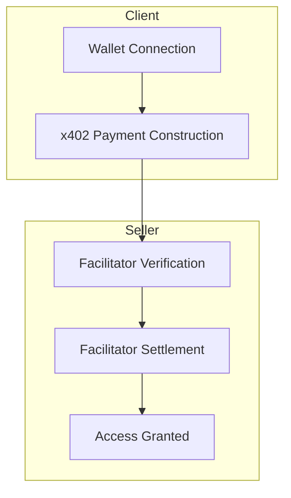
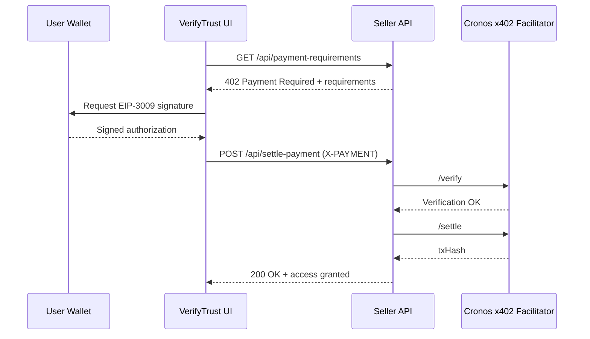

# VerifyTrust — Features

VerifyTrust is a **wallet-first access and payments gateway** for the **Cronos EVM**, powered by the **x402 payment protocol**.
It enables developers to convert protected APIs and digital resources into **pay-per-request experiences**, with on-chain settlement and no traditional user accounts.

---

## Core Capabilities

* **Wallet-first onboarding**
  No accounts, passwords, or email addresses—authentication and payment are unified through the wallet.

* **On-chain settlement**
  Stablecoin payments settle directly on Cronos, producing a verifiable `txHash` for every access.

* **HTTP-native payments**
  x402 extends standard HTTP semantics, allowing any request to become a paid request via a single header.

* **Minimal seller integration**
  A small, well-defined API surface handles pricing, verification, and settlement.

---

## Feature Stack Overview

---

## Feature Breakdown

### 1. Wallet-First Access

**What it enables:**
Users authenticate and transact using a wallet—no secondary identity system required.

**How it works:**

* Supports MetaMask and WalletConnect.
* Clean redirect flow: `/` → `/pay?address=<walletAddress>`.
* Address-based session state minimizes friction while preserving user control.

**Why it matters:**
Authentication and payment collapse into a single cryptographic primitive: wallet ownership.

---

### 2. x402 “Exact” Payment Model

**What it enables:**
Deterministic, single-use payments for gated resources.

**How it works:**

* Sellers define pricing via a `paymentRequirements` object.
* Buyers construct and sign an x402 envelope.
* The `X-PAYMENT` header upgrades a standard request into a paid request.

**Why it matters:**
The “exact” scheme ensures buyers pay precisely once, and sellers settle immediately.

---

### 3. Cronos-Native Settlement

**What it enables:**
Fast, low-cost stablecoin payments with on-chain proof.

**How it works:**

* Network: Cronos EVM (`chainId` 25).
* Settlement is handled by the Cronos x402 Facilitator.
* Verification and settlement occur in two explicit steps.

**Why it matters:**
Every access event is backed by a verifiable transaction hash, improving trust and auditability.

---

### 4. Minimal Seller API Surface

**What it enables:**
Rapid integration without complex backend infrastructure.

**Endpoints:**

* `GET /api/payment-requirements`
  Returns pricing and payment metadata.
* `POST /api/settle-payment`
  Verifies and settles the payment.

**Why it matters:**
Sellers can gate content or APIs with minimal code and no direct blockchain management.

---

## End-to-End Payment Journey

---

## What Differentiates VerifyTrust

* **Payments-native by design**
  Not a login system with payments added later—payment is the access primitive.

* **On-chain proof of access**
  Each successful request corresponds to a transaction hash.

* **Composable and generic**
  Any HTTP endpoint can be gated using the same x402 pattern.

* **Hackathon-ready architecture**
  A focused, demoable flow with minimal setup and clear outcomes.

---

## Near-Term Enhancements

* Dynamic pricing by endpoint or user segment.
* Persistent receipt storage for analytics and dispute resolution.
* Testnet support for faster demos and CI integration.
* Automatic 402 detection and retry flows in the client.