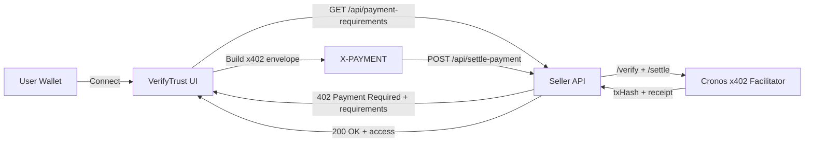
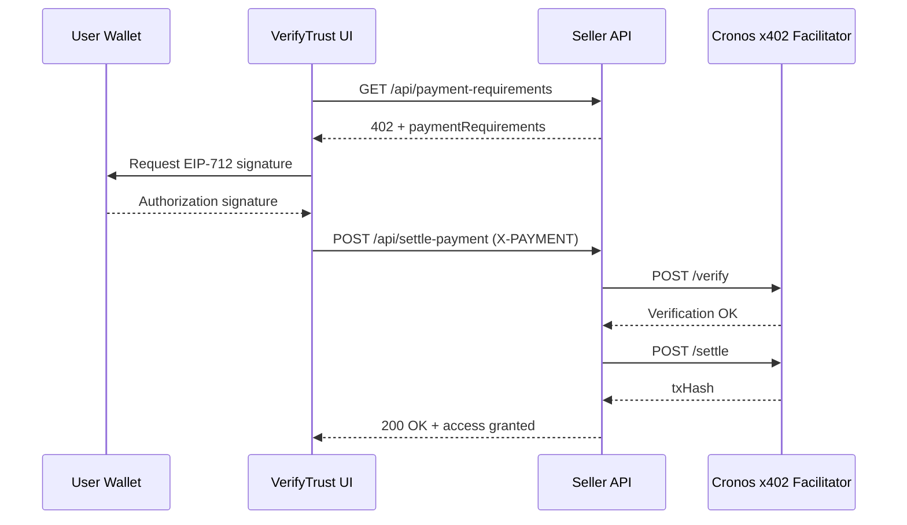

# x402 Deep Dive: VerifyTrust

VerifyTrust uses the **x402 payment protocol** to transform a standard HTTP request into a **paid, on-chain settlement**—without accounts, passwords, or off-chain identity.
This document explains how the x402 flow is implemented in VerifyTrust, how data moves between client and server, and how settlement is handled on **Cronos mainnet**.

---

## Why x402 in VerifyTrust?

**Objective:** Unlock protected resources using a single wallet-based payment, with no traditional authentication layer.

x402 aligns naturally with this goal:

* **Wallet-first experience**
  Users connect once, pay once, and immediately access gated content.

* **Chain-native settlement**
  Payments settle directly on Cronos using stablecoins, verified via the Cronos x402 Facilitator.

* **HTTP-native design**
  Authorization is carried in a single `X-PAYMENT` header, preserving standard web request semantics.

---

## High-Level Feature Map



---

## Protocol Flow (Step by Step)

### 1. Requesting a Protected Resource

The client requests a gated endpoint.
If payment is required, the seller responds with:

* HTTP `402 Payment Required`
* A `paymentRequirements` object describing how to pay

---

### 2. Constructing the Payment Authorization

The client builds an **x402 payment envelope**:

* Uses **EIP-712 typed data**
* Signs an **EIP-3009 `TransferWithAuthorization`**
* Encodes the envelope as a base64 `X-PAYMENT` header

This header fully represents the payment authorization.

---

### 3. Verification and Settlement

The seller forwards the `X-PAYMENT` header to the **Cronos x402 Facilitator**:

1. **`/verify`**

   * Validates the signature and payment requirements
2. **`/settle`**

   * Executes the on-chain transfer
   * Returns a `txHash` as proof of settlement

Once settlement succeeds, the protected resource is unlocked.

---

## Data Contracts

### `paymentRequirements` (Seller → Client)

```json
{
  "network": "cronos",
  "scheme": "exact",
  "payTo": "0xSellerAddress",
  "asset": "0xStablecoinAddress",
  "amount": "1.00",
  "currency": "USDC",
  "description": "VerifyTrust wallet verification access"
}
```

**Key fields**

* `network`: Identifies Cronos mainnet
* `scheme`: Uses the x402 **exact** payment model
* `payTo`: Destination address for funds
* `asset`: ERC-20 stablecoin contract
* `amount`: Human-readable payment amount

---

### `X-PAYMENT` Header (Client → Seller)

* Base64-encoded x402 envelope
* Contains EIP-3009 authorization data
* Signed by the paying wallet
* Replayable only within the constraints of the authorization

---

## Cronos-Specific Settlement Details

VerifyTrust targets **Cronos mainnet**:

* **Chain ID:** `25`
* **RPC:** `https://evm.cronos.org/`
* **Settlement layer:** Cronos x402 Facilitator

The facilitator serves as the seller’s single integration point:

* Validates x402 envelopes
* Executes on-chain settlement
* Returns transaction hashes and receipts

This removes the need for sellers to manage token contracts or signature validation directly.

---

## Architecture Deep Dive

### 1. Buyer UI

**Files:** `pages/index.tsx`, `pages/pay.tsx`

Responsibilities:

* Wallet connection (MetaMask / WalletConnect)
* Fetching `paymentRequirements`
* Building and signing the x402 envelope
* Submitting `X-PAYMENT` to the seller

---

### 2. Seller API

**Files:**

* `pages/api/payment-requirements.ts`
* `pages/api/settle-payment.ts`

Endpoints:

* **`/payment-requirements`**
  Returns pricing and payment metadata
* **`/settle-payment`**
  Verifies and settles the payment via the facilitator

---

### 3. x402 Integration Layer

**File:** `lib/x402Cronos.ts`

Provides:

* Cronos-specific “exact” scheme definitions
* EIP-3009 authorization construction
* Facilitator verification and settlement calls

---

## Security & Validation Checklist

Before forwarding payments to the facilitator:

* Validate `network`, `payTo`, and `asset`
* Enforce strict amount bounds
* Require a well-formed `X-PAYMENT` header
* Log facilitator responses for auditability

These checks reduce the risk of malformed, replayed, or malicious payment attempts.

---

## End-to-End Sequence Diagram



---

## Why This Matters

* **Instant monetization**
  Any HTTP endpoint can become pay-to-access.

* **Zero accounts**
  Authentication and payment are unified through the wallet.

* **On-chain proof**
  Every successful access corresponds to a verifiable transaction.

* **Composable design**
  The same x402 flow works for APIs, UIs, and machine-to-machine access.

---

## Future Enhancements

* Automatic retry logic when a `402` response is detected
* Persistent storage of settlement receipts for analytics
* Testnet support for faster iteration and demos
* Integration with identity or ZK proofs post-payment

---
