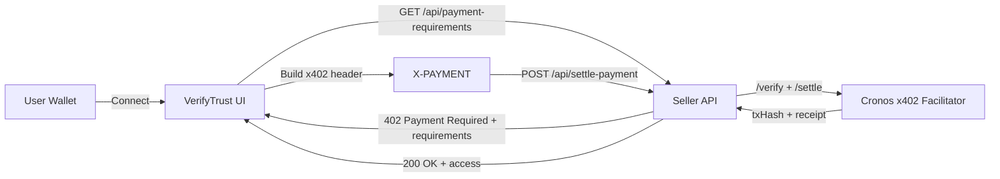
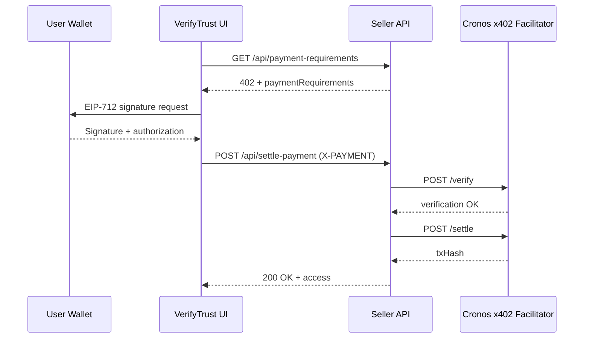

# x402 Deep Dive for VerifyTrust

VerifyTrust uses the x402 payment protocol to turn an HTTP request into a paid, on-chain settlement without accounts or passwords. This document explains the feature flow, the data that moves between client and server, and how Cronos-specific settlement is handled.

---

## Why x402 here?

**Goal:** unlock protected resources with a single wallet-based payment, no off-chain identity.

- **Wallet-first UX:** connect once, pay once, access gated content.
- **Chain-native settlement:** Cronos EVM with stablecoins, verified via the Cronos x402 Facilitator.
- **HTTP-native:** a single `X-PAYMENT` header carries the authorization envelope.

---

## Feature map at a glance



---

## Protocol flow (step-by-step)

1. **Client requests a protected resource.**  
   The seller responds with `402 Payment Required` and a `paymentRequirements` object.

2. **Client constructs payment authorization.**  
   The UI builds an x402 envelope:
   - Uses EIP-712 typed data for EIP-3009 `TransferWithAuthorization`.
   - Encodes it into a base64 `X-PAYMENT` header.

3. **Seller verifies and settles.**  
   The API forwards the header to the Cronos Facilitator:
   - `/verify` validates the signature and requirements.
   - `/settle` executes settlement and returns `txHash`.

---

## Data contracts

### `paymentRequirements` (seller response)

```json
{
  "network": "cronos",
  "scheme": "exact",
  "payTo": "0xSellerAddress",
  "asset": "0xStablecoinAddress",
  "amount": "1.00",
  "currency": "USDC",
  "description": "VerifyTrust wallet verification access"
}
```

### `X-PAYMENT` header (buyer request)

- Base64-encoded x402 envelope
- Includes EIP-3009 authorization data
- Signed by the wallet that will pay

---

## Cronos-specific settlement

VerifyTrust targets Cronos mainnet:

- **Chain:** Cronos EVM (`chainId` 25)
- **RPC:** `https://evm.cronos.org/`
- **Settlement:** Cronos x402 Facilitator (`/verify`, `/settle`)

The facilitator is the single integration point for sellers. It validates the signed authorization, settles the transfer, and returns a transaction hash as proof.

---

## Architecture deep dive

### 1) Buyer UI

**Files:** `pages/index.tsx`, `pages/pay.tsx`

- Connects wallet (MetaMask / WalletConnect).
- Fetches `paymentRequirements`.
- Builds and signs the x402 envelope.
- Posts `X-PAYMENT` to `/api/settle-payment`.

### 2) Seller endpoints

**Files:** `pages/api/payment-requirements.ts`, `pages/api/settle-payment.ts`

- **/payment-requirements** returns the seller's price sheet.
- **/settle-payment** verifies and settles the payment.

### 3) x402 helper

**File:** `lib/x402Cronos.ts`

- Defines the "exact" scheme requirements.
- Builds EIP-3009 `TransferWithAuthorization`.
- Talks to the Cronos facilitator.

---

## Security and validation checklist

- Validate `network`, `payTo`, and `asset` before forwarding.
- Reject invalid or oversized amounts.
- Ensure `X-PAYMENT` header is present and well-formed.
- Log facilitator responses for audits and debugging.

---

## Sequence diagram



---

## What makes this feature compelling

- **Instant monetization:** a single request can unlock paid content.
- **Zero accounts:** no email, no password, just a wallet.
- **Chain verified:** settlement produces an on-chain txHash.
- **Composable:** x402 works for any gated API, not just a UI.

---

## Next-level enhancements

- Add a retry UI that auto-detects `402` and replays with `X-PAYMENT`.
- Persist settlement receipts in a database for analytics.
- Expand to testnet requirements for faster demos.

